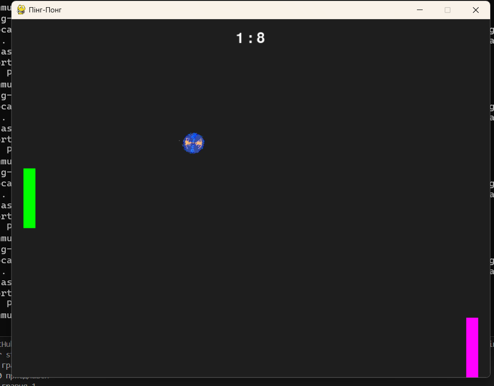

# Онлайн Пінг-Понг

> Це шаблон для створення власної онлайн-гри **Пінг-Понг** на двох гравців. Гра вже працює через локальну мережу — залишилось зробити її красивою! 

## 🎮 Що є у грі:

- ✅ Готовий сервер і клієнт (гравець)
- ✅ Фізика м’яча та платформи
- ✅ Перемога при рахунку 10
- ✅ Очікування другого гравця
- ✅ Події зіткнення (для звуків)
- ✅ Звуки
- ✅ Вигляд м’яча
- ⬜ 
- ⬜ 

## 🔊 Звуки

### 🟦 Звук удару об платформу
Відтворюється коли м’яч торкається платформи гравця.

### ⬜ Звук удару об межу
Звук відтворюється коли м’яч торкається межі.

### 🏆 Звук перемоги
Відтворюється коли гравець перемагає у грі та набирає 10 очок.

### ❌ Звук програшу
Відтворюється коли гравець програє гру.

## 🖼️ Як виглядає гра



## 💡 Що можна додати

### Main menu:
Головний екран гри, де гравець може почати лобі або приєднатися до існуючого

### Кастомізація:
Може змінювати вигляд своєї платформи

### Ім’я користувача:
Введення та відображення нікнейму гравця в грі

### Налаштування:
Меню для зміни параметрів гри (звук, керування)

### Зміна фону:
Можливість обирати або змінювати задній фон гри

### Власна музика:
Додавання та використання своєї музики під час гри

### Покращений дизайн:
Оновлений та більш сучасний вигляд інтерфейсу гри

### Лобі:
Кімната очікування перед матчем, де гравці збираються перед грою

### Чат:
Система повідомлень між гравцями під час очікування або гри

## Як запустити проєкт

1. **Завантаж проєкт**
   - Можеш клонувати або завантажити ZIP:
     ```
     git clone https://github.com/KravaAO/ping-pong.git
     ```

2. **Увімкни сервер**
   - Відкрий `server.py` і запусти його:
     ```
     python server.py
     ```

3. **Запусти клієнта (2 рази)**
   - Відкрий два вікна (на одному або різних комп’ютерах з допомогою викладача) і запусти `client.py`:
     ```
     python client.py
     ```

> ⚠️ Усі файли мають бути у тій самій папці. Сервер запускається **лише один раз**, а `client.py` — для кожного гравця.

## Як це працює?

### Сервер (`server.py`)
- Очікує **двох гравців**
- Веде гру: рухає м’яч, перевіряє зіткнення, надсилає **стан гри**
- Приймає команди `UP`, `DOWN` від гравців

### Клієнт (`client.py`)
- Підключається до сервера 
- Відображає гру, платформи, м’яч, рахунок
- Відправляє натискання клавіш (`W` / `S`) на сервер

